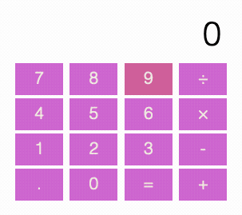

# Challenges

- **Use Git to make a commit every time you get an answer working. Use sensible commit messages.**

- Make sure you keep React DevTools ([Firefox](https://addons.mozilla.org/en-US/firefox/addon/react-devtools/)/[Chrome](https://chrome.google.com/webstore/detail/react-developer-tools/fmkadmapgofadopljbjfkapdkoienihi)) + JS console open at all times and correct anything that it flags up.

---

For all of the following components you should break them up into sensible sub-components. You should create a directory per challenge.

- Create a `<ToDoList>` component. It should have an input, a submit button, and a list of items.

    Sub-components:

    - `<Input>`: where the user types the value, should include the "Submit" button
    - `<List>`: the to do list items
        - `<ListItem>`: each item in turn

- Create a `<Calculator>` component. It should have one button for each digit between 0 and 9, four buttons for `+`, `-`, `×`, and `÷`, and an `=` button. It should work like an old-school calculator: as you press digits they appear on the screen, then you click an operator, then you type in another number. When you press the `=` button the answer appears on screen. If you're feeling fancy add memory buttons too: `M+` (add to memory), `MC` (clear memory), and `MRC` (memory recall).

    Sub-components:

    - `<Display>`: showing the input/result
    - `<Button>`: a generic component for any button

    

- Create a two-player noughts and crosses game (i.e. two users playing, no AI). It should alternate automatically between noughts and crosses. It should also know when the game is over and display who has won.

    Sub-components:

    - `<Square>`: each of the individual squares

- Create a Sudoku board where a user can input values. It should be able to detect if a board is valid.

    Sub-components:

    - `<Square>`: each of the individual squares
