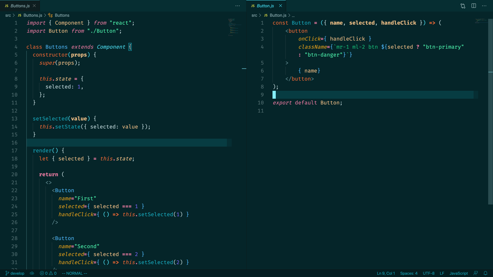

# Challenges

- **Use Git to make a commit every time you get an answer working. Use sensible commit messages.**

- Make sure you keep React DevTools ([Firefox](https://addons.mozilla.org/en-US/firefox/addon/react-devtools/)/[Chrome](https://chrome.google.com/webstore/detail/react-developer-tools/fmkadmapgofadopljbjfkapdkoienihi)) + JS console open at all times and correct anything that it flags up.

## Setup

- Create a new React app for this week
- Use split code view show your parent and child component at the same time

## Lifting State

All of the following challenges will require more than one component. You may want to create a directory per challenge.

You might also find it easier to create them as a *single component* first and then to break out the repeated sub-component once you've got it working.

- Create a component `<Squares color="hotpink">` that displays two of your `<Square>` components from last week and passes through the `color` prop. As before, when clicked the background colour should change. But only one of the `<Square>`s should show the given colour at once. You'll need to turn your squares back into stateless components.

- Create a component `<Password label="Password">` that contains an `<input>` with a `<label>`. Inside a `<SignUp minimumLength={ 12 }>` component put two of these `<Password>` components: one should have the label "Password" and the other "Confirm Password". Both `<Password>` components should have a red border *unless* they are longer than `minimumLength` and match each other.

## Tricksy

- Create a component `<Max count={ numbers }>` that you pass an array of numbers. For each number in the array it should display one of your `<Counter>` components from last week with that number as the initial value. The counter with the highest value should be highlighted.
