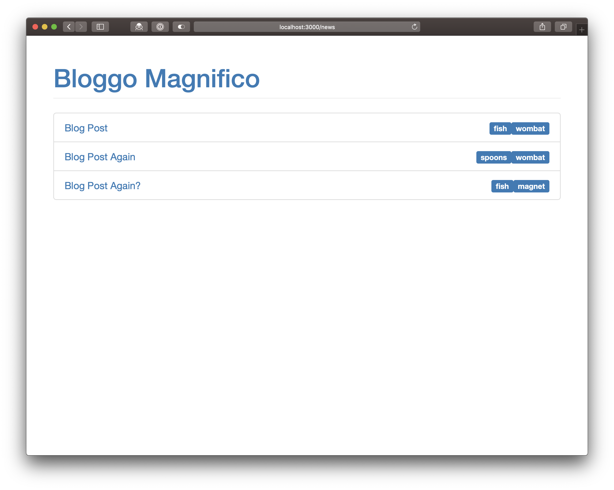
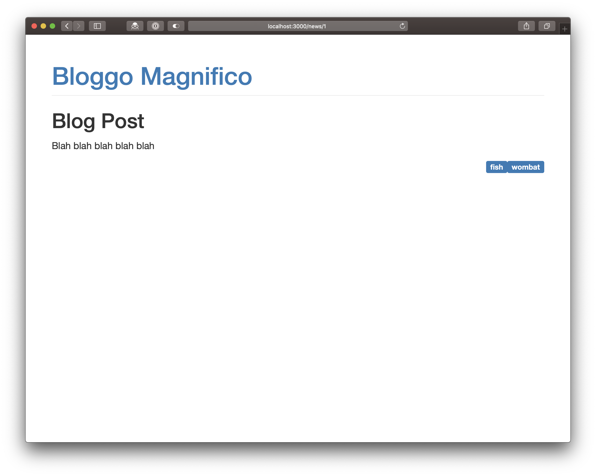
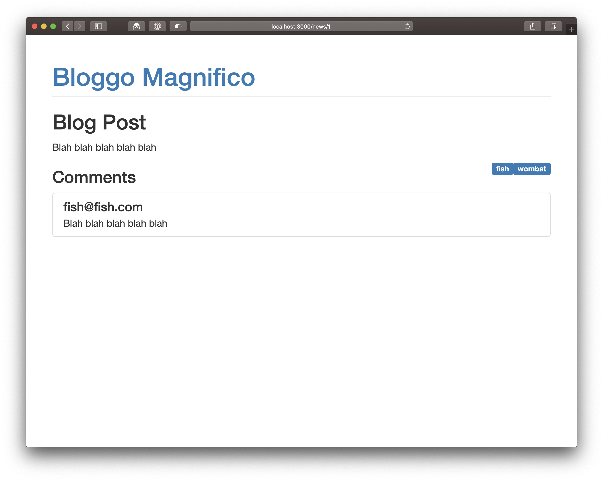
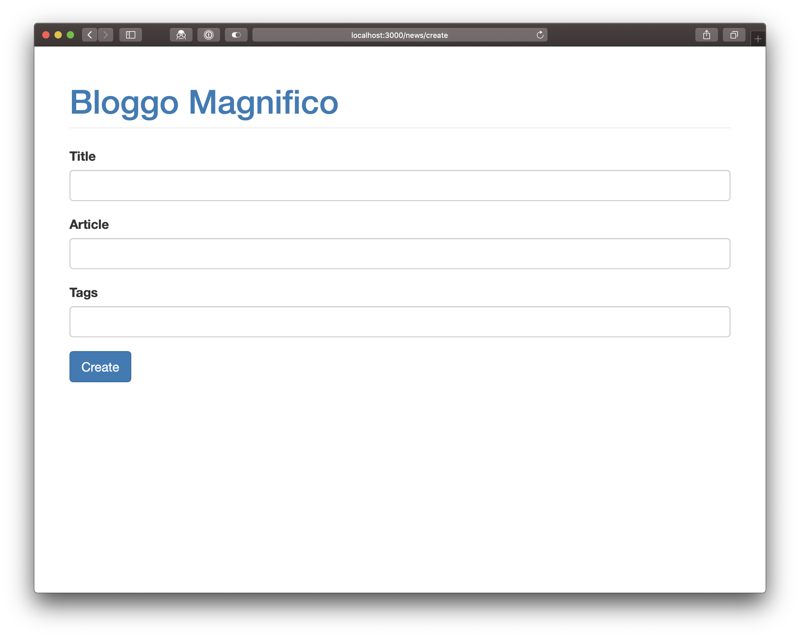
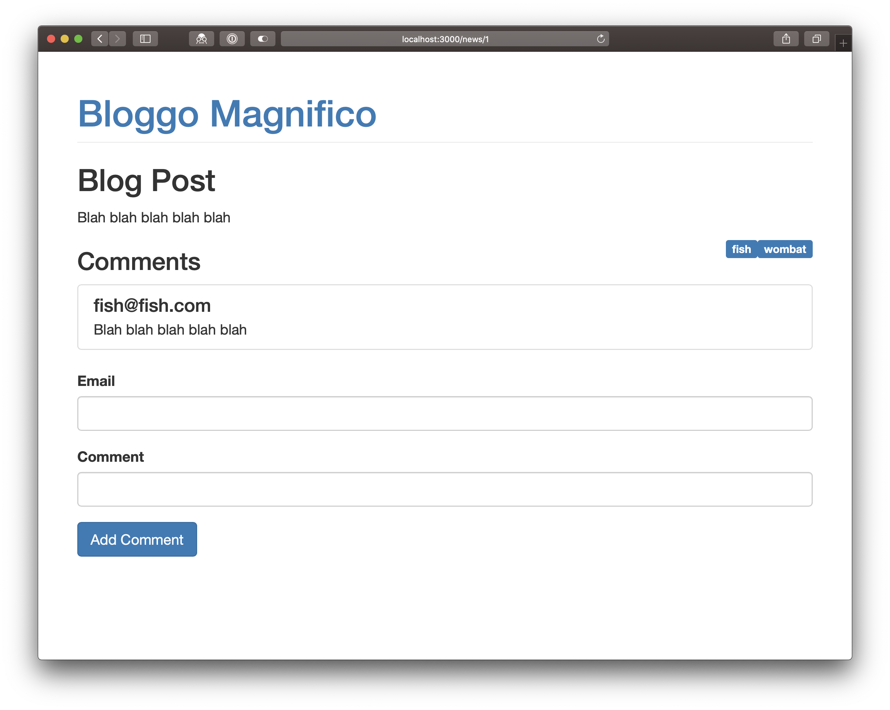
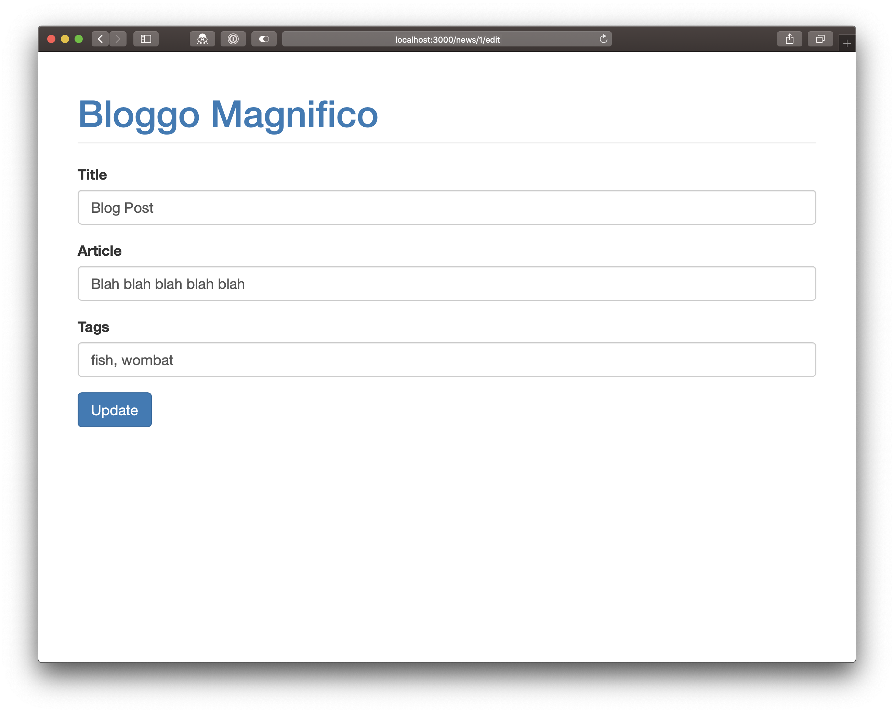

# Challenges

- **Use Git to make a commit every time you get an answer working. Use sensible commit messages.**

- Make sure you keep React DevTools ([Firefox](https://addons.mozilla.org/en-US/firefox/addon/react-devtools/)/[Chrome](https://chrome.google.com/webstore/detail/react-developer-tools/fmkadmapgofadopljbjfkapdkoienihi)) + JS console open at all times and correct anything that it flags up.

- Use the Network panel to check requests are being made (filter by "XHR" to just see AJAX requests)

- Use Postman to check your API requests if you're not sure what you need to send.

## APIs with React

We're going to add a "News" section to our (quite bizarre) app.

We'll use the [`restful.training`](https://github.com/develop-me/restful.training#restfultraining) API that you worked with when your first learnt about APIs. (You'll need the password `wsYZzT8_m_pwBNDjSk77` to sign-up if you've lost your login.)

### Setup

- Put these components in a `news` directory inside your existing React app.
- Make sure you've got React Router installed
- Use your axios config from earlier

### `GET`

These challenges all involve making a `GET` request when a component first loads. You should show a loading message until you get back a response:

- Create a component `<Articles>` which lists all of the articles. Using ReactRouter, it should show when you go to `/news`

- Create a component `<Article id={ number }>` which shows a specific article based on its `id`. It should show when you go to `/news/{id}`
    - Update your `<Articles>` component to link through to `<Article>`

- Create a component `<Comments articleID={ number }>` which lists all of the comments for a given article.
    - Update your `<Article>` component to use the `<Comments>` component at the bottom

### `POST`

These challenges all involve sending data to the server when a form is submitted.

- Create a component `<CreateArticle>` which allows you to submit an article to the API. You should be able to get to it by going to `/news/create`

- Create a component `<CreateComment articleID={ number }>` which allows you to submit a comment for a specific article to the API
    - Add it to the `<Article>` component  above the `<Comments>` component

## Tricksy

- Create a component `<EditArticle>` which allows you to update an article. You should be able to get to it by going to `/news/{id}/edit`. It will need to load the article information when the component first loads and submit it with a `PUT` request when the form is submitted.

- Update your `<Article>` and `<EditArticle>` components to show a 404 message if it isn't found on the server

## Über-Tricksy

- If you submit incorrect data to `<CreateArticle>`, `<CreateComment>` or `<EditArticle>` you will get a `422` response. Use this to show validation errors to the user. You'll need to use Axios' error handling.
