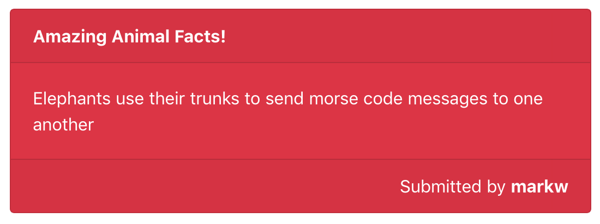
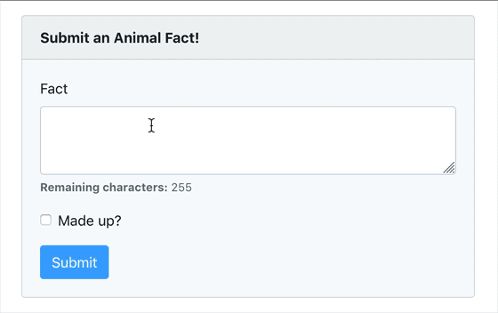
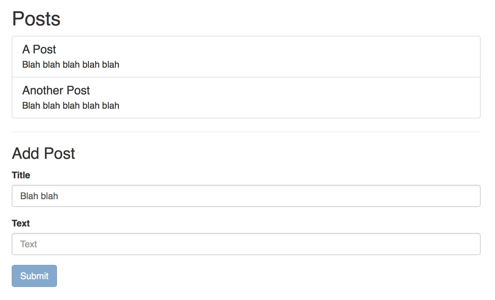

# Quiz

---

## Rules

- If you get stuck on one for more than 15 minutes, try a different one and come back to it later.
- Feel free to vent any frustration with some [Hikaru Dorodango](https://www.dorodango.com)

---

## API Requests

[`restful.training`](https://github.com/develop-me/restful.training#animal-facts) has an "Animal Facts" API. (You'll need the password `wsYZzT8_m_pwBNDjSk77` to sign-up if you've lost your login.)

Put these components in an `animal-facts` directory inside `src`.

Use React Bootstrap where appropriate.

- Create a `<Random>` component that displays a random animal fact in a `<Card>`. If the fact is made up then display it in a red box, otherwise display it in a green box.

    

- Create a `<Post>` component that posts an animal fact. It should have a textarea with a maximum length of 255 and a checkbox for whether the fact is made up or not. Make sure the user doesn't submit an empty fact. Once the fact is submitted it should show an appropriate message.

    **Any facts you add will appear in other people's apps, so don't write anything you wouldn't want to share**

    

## Lifting State & Passing Data Up

Create a component `<Posts>` that consists of a list of items that have a title and some text. Underneath the list of items should be a `<Form>` component that has a "Title" and "Text" input and a "Submit" button.

- You should only be able to submit the form if all the inputs have something typed in them.
- When the form is submitted it should add a new item to the list of posts.
- When the form is submitted the form fields should become blank
- The inputs should be controlled by the `<Form>` component and only pass their values up to `<Posts>` when the `<form>`'s `onSubmit` event handler is fired.
- If there are no posts it should say "No posts"
- Feel free to make other components if it makes sense to do so
- Make it so that `<Posts>` is visible if you visit the root route (i.e. `/`)

